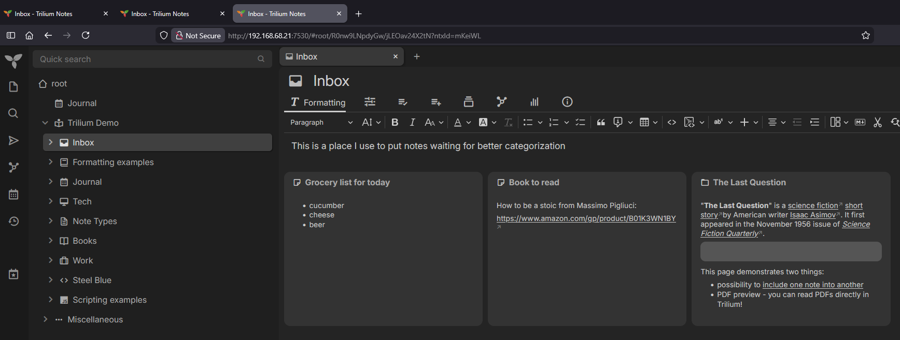
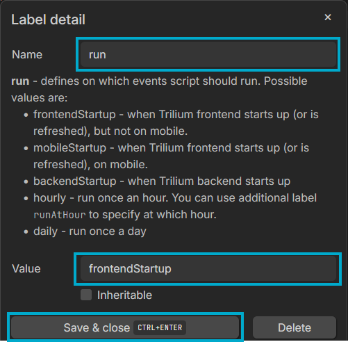

# Trilium Instance Name on Browser Tab

A lightweight, self-contained JavaScript frontend script for [Trilium Notes](https://github.com/zadam/trilium) that gives each instance a clear visual identity inside your browser.

This is especially useful if you run multiple Trilium **server** instances (e.g., Work, Personal, Lab) and often have several browser tabs open at once.  
If you only run the *desktop app*, you may not benefit from this script.

---

## Why This Exists

Trilium Notes makes it easy to run multiple server instances (for example: Work, Personal, and Lab),
and to open them in separate browser tabs. The downside is that all of those tabs can look very
similar at a glance.

This script was created to solve one simple problem:

> “When I have several Trilium tabs open, I want to instantly see which one is which.”

By adding a bold text prefix, optional border, and optional custom favicon per instance, it becomes
much easier to distinguish:

- which tab is Work
- which tab is Personal
- which tab is Lab
- which tab is your “primary” instance vs. others

If you only use the standalone desktop app, you may not need this script. It’s primarily intended
for browser-based access to Trilium server instances.

---

## Features

- ⭐ **Bold tab prefix** showing which instance you're looking at  
- 🌈 **Per-instance color branding**  
- 🔤 **Optional custom favicon** (colored background + letter)  
- 🖼 **Optional browser-wide colored border**  
- ⚙️ **Fully customizable through a simple config block**  
- 🧱 **Pure JavaScript (frontend)** — no server modifications  
- 🌍 **Works in any browser** where the Trilium UI loads  

---

## Installation (Per Trilium Server Instance)

### 1. Create a new Code note

- In Trilium, create a new note anywhere you like  
- Set the note type to **Code**  
- Set the language to **JavaScript (frontend)**  

### 2. Paste the script

Copy the contents of `trilium-instance-identity.js` from this repository  
and paste it into the new Code note.

### 3. Configure it

Edit this block at the top of the script:

```js
// ==== CONFIG PER INSTANCE ====
// Type this in NORMAL letters. Script will bold it for you.
const PLAIN_PREFIX_TEXT = "INSTANCE NAME";   // becomes [𝗜𝗡𝗦𝗧𝗔𝗡𝗖𝗘 𝗡𝗔𝗠𝗘] in the browser tab
const COLOR             = "#1e88e5";         // border + favicon background
const LETTER            = "C";               // favicon letter
const LETTER_COLOR      = "#ffffff";         // favicon letter color
const USE_FAVICON       = true;              // true = custom icon, false = default Trilium icon
const USE_BORDER        = true;              // true = draw border
const BORDER_THICKNESS  = 6;                 // border width in pixels
// =============================
```

Use a **different prefix and color** for each instance so the tabs are easy to distinguish.

### 4. IMPORTANT: Add the `#run=frontendStartup` attribute correctly

This step can be confusing.

#### **Do NOT just type `#run=frontendStartup` into the note body.  
That may NOT work.**

Instead:

1. Select the Code note  
2. Click the **Attributes** sidebar  
3. Click the **+** button  
4. Add a new attribute  
   - **Name:** `run`  
   - **Value:** `frontendStartup`  
5. Save the attribute  

Trilium will automatically display it as:

```
#run=frontendStartup
```

For best results, users should follow this exact method — copy/pasting the text might **not** create a real attribute.

### 5. Hard refresh the browser

Press **Ctrl + F5**.  
You should now see:

- The tab label  
- Optional colored border  
- Optional custom favicon  

Repeat per instance.

---

## Important Notes About the Trilium Desktop App

If you use the **desktop app** and connect it to a server instance that has this script enabled:

- The **border will also appear around the desktop app window**, because the script runs inside the embedded browser engine.
- If you prefer your desktop app to have *no border*, simply:
  - Keep `USE_BORDER = false` for that instance  
  - Or create a separate “desktop copy” of the script with a different config

This is normal behavior.

---

## Example Configurations

### Work instance

```js
const PLAIN_PREFIX_TEXT = "WORK";
const COLOR             = "#1e88e5";
const LETTER            = "W";
const LETTER_COLOR      = "#ffffff";
const USE_FAVICON       = true;
const USE_BORDER        = true;
const BORDER_THICKNESS  = 6;
```

### Personal instance

```js
const PLAIN_PREFIX_TEXT = "PERSONAL";
const COLOR             = "#43a047";
const LETTER            = "P";
const LETTER_COLOR      = "#ffffff";
const USE_FAVICON       = true;
const USE_BORDER        = true;
const BORDER_THICKNESS  = 6;
```

### Lab instance

```js
const PLAIN_PREFIX_TEXT = "LAB";
const COLOR             = "#f27d30";
const LETTER            = "L";
const LETTER_COLOR      = "#000000";
const USE_FAVICON       = true;
const USE_BORDER        = true;
const BORDER_THICKNESS  = 8;
```

---

## Troubleshooting

### **Tab prefix didn't show up**
- Ensure the note *actually* has the attribute  
  (created using the + button as described above)
- Hard-refresh (`Ctrl + F5`)  
- Make sure it's a **JavaScript (frontend)** Code note

### **Favicon didn't update**
- Browsers cache favicons aggressively  
- Close and reopen the tab  
- Verify `USE_FAVICON = true`

### **Border didn't appear**
- Confirm `USE_BORDER = true`
- Try increasing thickness  
- Confirm the color is valid (`#RRGGBB`)

---

## Tested With

This script was developed and tested with:

- **Trilium Notes:** 0.99.5  
- **Browsers:**  
  - Firefox (latest)  
  - Microsoft Edge (latest)  
  - Google Chrome (latest)

Because the script runs entirely in the browser UI, it should work in any browser that can load the Trilium web interface.  
Behavior in older Trilium versions has not been tested.

---

## Screenshots

A few visual examples of how the script customizes each Trilium instance.

### Three instances with standard Trilium browser tabs


### Adding the Script


### Setting the script attributes to run at startup


### Starting the script


### LAB instance completed


### All instances set


---

## Support

This project is provided as-is.  
You’re welcome to open GitHub issues for bugs or suggestions but you might be on your own.  
Pull requests are welcome.

---

## Credits

Created by **Br0kenSilos** with assistance from ChatGPT.

---

## Acknowledgements

Huge thanks to the people who make Trilium possible:

- **@zadam**, the original author of Trilium Notes, for creating one of the most powerful and flexible
  personal knowledge management systems available today.

- **@eliandoran** and the **Trilium Next team**, for picking up the project, modernizing it, and keeping
  the ecosystem healthy and moving forward.

This script is an unofficial user customization and is not affiliated with or endorsed by the
Trilium or Trilium Next projects. It was built simply because Trilium is awesome — and because
running multiple instances in browser tabs can get confusing without some extra visual identity.

---

## License

This project is licensed under the [MIT License](LICENSE).
